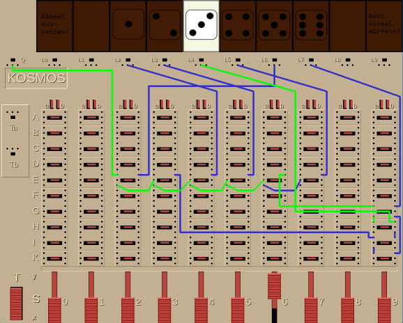
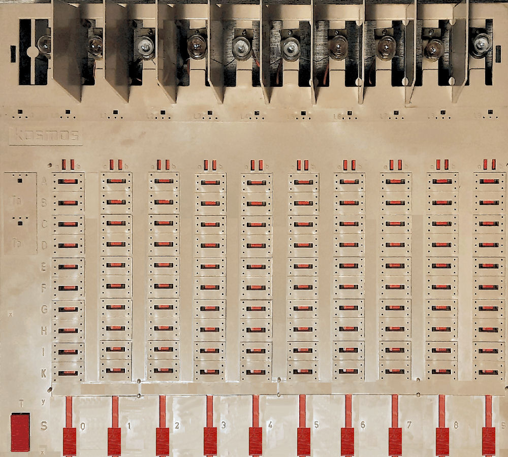

# Logikus — The Toy Computer Emulation

[](https://www.python.org/)
[](https://www.pygame.org/news)
[](LICENSE)


The **Spielcomputer LOGIKUS** (*Toy Computer Logikus*) was an educational toy produced by the German
company **Kosmos**. It was designed to teach children the basics of logical circuits and programming-style thinking
using switches, wires and lamps. To be frank, it was neither a toy nor a computer in the modern sense (or maybe *any*
ssense), but rather a simple logic puzzle device that allowed users to create and test various logical configurations.
The device featured a board with contact points, wires to connect them, and lamps that would light up based on the
connections made.

The main goal was to connect the start contact `Q` to the lamps in such a way that they would light up, demonstrating
the principles of logical operations. To call it a computer is a bit of a stretch, but it was an early educational tool
that introduced many to the concepts of logic and circuitry in a hands-on way. It was quite popular in Germany and has
since become a nostalgic item for many who grew up with it. With a price of 78 DM (Deutsche Mark) in the late 1960s, it
was a significant investment for a toy at the time, reflecting its educational value and the complexity of the device.

The Logikus is remembered fondly by many as a unique and engaging way to learn about logic and circuits...


For more historical background see the Wikipedia article: https://de.wikipedia.org/wiki/Logikus

## Project Overview

This project is an emulation of the Logikus toy computer implemented in Python using the `pygame` library. The goal is
to reproduce the complete behavior and user interaction of the original device while providing a simple graphical
interface for experimentation.

## Key Features

- Graphical emulation using `pygame` with movable sliders, pushable button and "glowing" lamps.
- Add and remove wire connections dynamically (file-based and runtime editing).
- Keyboard and mouse controls for interacting with the board.
- Load and save wire configurations from text files (extension `.lkw` ).
- Compute electrical connectivity between the start contact `Q` and lamps; lamps turn on/off accordingly.
- Portable: runs on any system with Python 3.x and `pygame`.
- Different skins for the Logikus board (classic, metal, ...).
- Open source under the MIT license

## Requirements

- Python 3.8+ (or 3.x)
- `pygame` (install with `pip install pygame`)

## Running

1. Install dependencies:

````
python -m pip install pygame
````

2. Start the emulator:

````
python -m logikus
````

## The Interface

The interface consists of a graphical representation of the Logikus board, including:

- A grid of contact points where wires can be connected using the mouse
- A start contact `Q` that serves as the source of the electrical signal (`Q` stands for "Quelle", German for "source")
- Multiple lamps (`L0`,...,`L9`) that light up based on the connections made
- A row of Sliders (`S0`,...,`S9`) that can be moved up and down to change the state of the contacts (`S` actually
  stands for "Schieber", German for "slider")
- A push button `T` that can be used as an additional input (stands for "Taster", German for "button")

### Where is the menu?

There is a hidden menu which appears if you move the mouse cursor to the top left corner of the window. It allows you to
load and save wirings in the form of projects. The idea is to keep the interface clean and focused on the board
itself, while still providing access to additional features through a hidden menu for those who know where to look.

## What can I do?

You can move the sliders up and down to change their state, press the button to toggle it, and connect wires between the
contact points. The lamps will light up based on the connections you make, allowing you to experiment with different
configurations and learn about logical circuits. You can also load predefined configurations from `.lkw` files or save
your own configurations for later use.

### Wiring

**Add a wire**  by clicking on an empty contact point and moving the mouse to another contact point. Click oon the
contact point to finish the connection.

**Remove a wire** by clicking on one of the contact points of an existing wire. This end of the wire becomes loose and
can be moved to another contact point. If you push the right mouse button, the wire is removed completely.

When in *wiring mode*, i.e. when you have clicked on a contact point to start a new wire or to move an existing wire,
the wire will follow the mouse cursor until you click on another contact point to finish the connection. You may however
click on intermediate points to create a multi-segment wire. This allows you to make the wirong a bit cleaner instead of
having criss-coss wires all over the place. The wire segments will automatically snap to the grid of contact points,
ensuring a neat and organized layout.

You may also edit the `wiring.lkw` file directly to create or modify wire connections. The file format is simple and
human-readable, allowing you to define connections between contact points in a straightforward way.

### Sliders

The ten sliders at the bottom can be toggled by clicking on them with the mouse. They can also be toggled by pressing
the corresponding number keys on the keyboard (0-9) However, due to the fact that the number keys on a keyboards are
labeled from 1 over 9 to 0, but the sliders numbers start with `S0` as the left-most sliders, I decided to map the
slider on the left `S0` to the `1` key on the left of the keyboard, and the right-most slider `S9` to the `0` key on the
right of the keyboard. I find it easier to find the correct key for a slider this way.

### The Button

The button `T` on the bottom left can be pushed by clicking on it with the mouse or using the `Space` key on the
keyboard. Sometimes you want the "electricity" to flow only when the button is pressed.

## Special Features

This emulation includes some features that were not present in the original Logikus, such as the ability to save and
load wire configurations, different skins for the board, and a hidden menu for accessing additional settings.

- If a lamp is lit, you may make the connections to it visible by hovering the mouse cursor over the lamp - the
  connecting wires turn to a bright color. This allows you to see how the *electricity flow* from the start contact `Q` to the lamp,
  which can be helpful for understanding the logic of your configuration. Note: Only one of the connections to the lamp
  is highlighted, even if there are multiple paths to the lamp.
- 



- Some keys on the keyboard trigger special actions in the emulator:

    - `G` — toggles grid visibility
    - `L` — dumps the current wiring configuration to the console in a human-readable format
    - `P` — creates a screenshot (*photo*) in the working directory

## The Load / Save menu, and Projects

tbd.

## The source code

### File Layout

#### Source code

All source code files are located in the `logikus` package. The main files are:

- `assets.py`- Creation of the graphics for Logikus. All graphics are generated programmatically. A skin may be chosen
  by
- specifying the `--skin option at startup. The default skin is the "classic" Logikus look.
- `controller.py` — input handling for keyboard and mouse.
- `logic.py` — the underlying logic for simulating the Logikus behavior. Contains the path finding algorithm for
  determining which lamps should light up based on the current wire configuration and slider/button states.
- `main.py` — main program and UI loop.
- `ui.py` — user interface components and rendering.
- `wiring.py` — functions for loading and saving wire configurations.

#### Projects

Som example projects with predefined wirings are located in the `projects` directory. Each project consists of a `.lkw`
file that defines the wire connections for that project. You can load these projects from the hidden menu in the
emulator to see different configurations and learn how they work.

#### Other Files

- `README.md` — this file.
- `LICENSE` — project license (MIT).

## Personal Remarks

This project was a fun and nostalgic exercise in recreating a classic educational toy. I had just bought a vintage
Logikus board on eBay and found it unfunctional. Most of the contacts did not work anymore, and the plastic had become
so
brittle that repairing it was not an option. I decided to create a software emulation of the Logikus instead, as I was
looking for a small but not trivial project to dive deeper into Python programming. So I made some photos of it and sent
it to plastic heaven.



You see the Logikus with the dark hub which removed, covers the small light bulbs. You could insert transparent paper
strips for different projects. If you look closely enough, you can see the small wire which connects one pole of the
battery to all all the light bulbs. The battery is located on the rear of the board in the top left corner. Its other
pole is connected to the source contact `Q`.

Based on this photo, I created the graphics for the emulation, which was a fun exercise in itself. I wanted to capture
the look and feel of the original Logikus as closely as possible, while also making it visually appealing and easy to
use on a computer screen.

### Implementing Logikus

It took me only a few hours to implement the basic logic, but - as usual - several weeks to implement the user interface
and make it look good. My first choice for the graphics was `Qt`, and I created a working emulation using `PyQt5` - the
`QLogikus`.

However, I found that `Qt` was a bit too heavy for this project, and I wanted something more lightweight and easier to
work with. That's when I decided to switch to `pygame`, and started from scratch with a new implementation. The result
is a much more responsive and visually appealing emulation that runs smoothly on a wide range of systems. Most
important, the graphics for the wiring in `Qt` was not very good. You simply have much fore freedom in `pygame`for
drawing.

I wanted to stay as close as possible to the original design, while also making some improvements and adding some
features that I thought would enhance the user experience. The graphics (board, switches and so on) are all generated
programmatically, which allows for easy customization and the ability to create different skins for the board.

## Todos

- Write a small tutorial for using the emulator and understanding the logic of the Logikus.

- Implement real project
- Implement history undo/redo for wire editing.
- Implement better import for lamp graphics
- More colors for wiring
- Implement smaller board versions.
- Add more skins and customization options.

