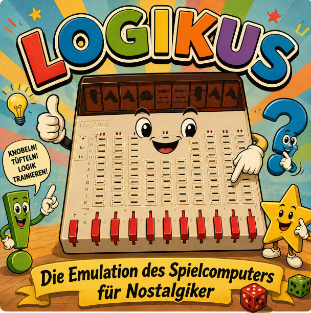

LOGIKUS - The Toy Computer Emulation
=====================

Welcome to the documentation for LOGIKUS, the toy computer emulation!

This project is a modern implementation of the classic LOGIKUS device. It provides all features of the classic device, while also adding some modern conveniences and improvements. Everybody who has worked with the original LOGIKUS will feel right at home. For those who are new to LOGIKUS, we provide a small introduction to the history and the concept of LOGIKUS, as well as a quickstart guide to get you up and running in no time.

.. toctree::
   :maxdepth: 2
   :caption: Guides

   user_guide/index
   developer_guide/index

Indices and Tables
==================

* :ref:`genindex`
* :ref:`modindex`
* :ref:`search`
