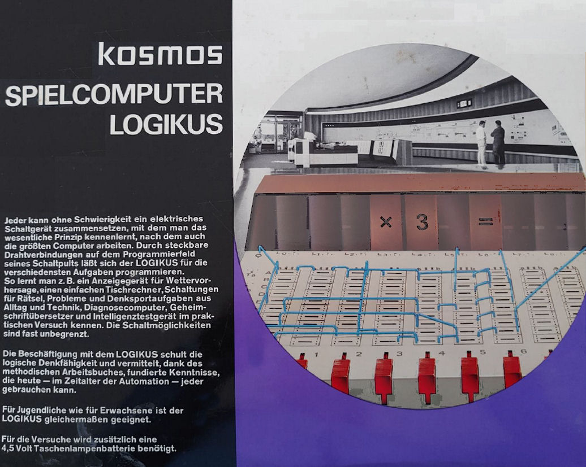
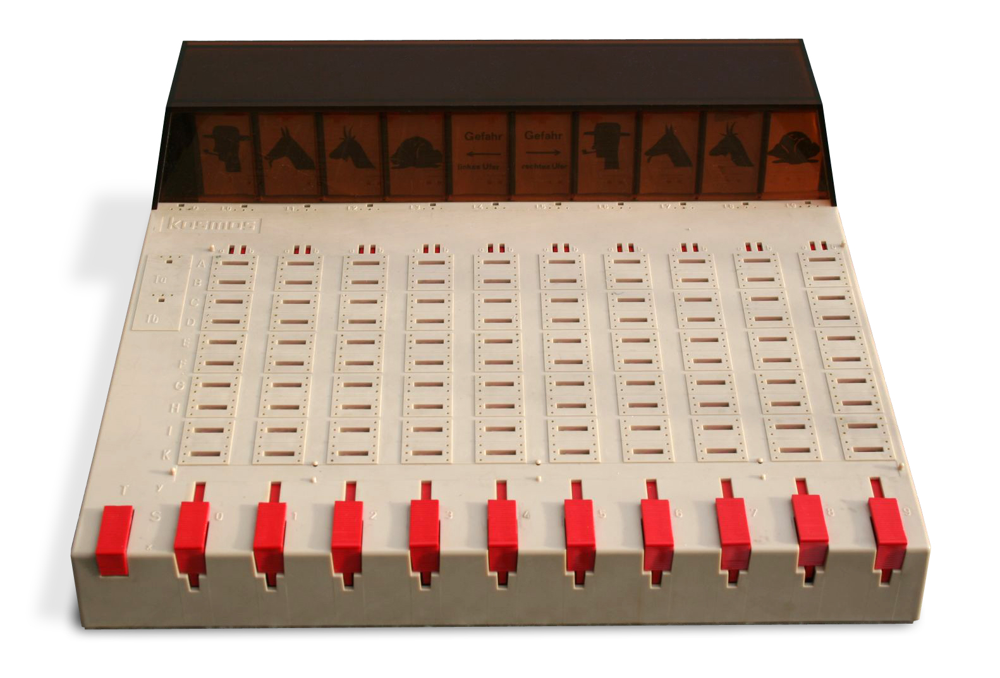

Logikus User Guide
==================

   quickstart
   usage

Welcome to the User Guide of LOGIKUS, the toy computer emulation!

This guide will help you get started with LOGIKUS, providing step-by-step instructions and examples to make the most out of this educational tool. Whether you're a beginner or an experienced programmer, you'll find valuable information to enhance your understanding of computer architecture and programming concepts.

The History: What was LOGIKUS?
------------------------------

On LOGIKUS was a toy computer of the German company KOSMOS, which was sold in the 1960/70s. It was designed to teach children and beginners about the basics of computer architecture and programming. LOGIKUS featured a simple design with a limited set of instructions, making it an ideal tool for learning.

To be frank: LOGIKUS was no computer at all, at least in the sense we are now talking of computers. It was more of a electro-mechanical device, where programming was done by putting wires into a patchboards, similar to a telephone switchboard. There were ten lamps on the top of the device, and the idea was to program the device in such a way that the lamps would light up when certain conditions were met. there were ten sliders on the bottom of the device, which were *not* linked to a specific lamp. However, moving them up and down would connect and disconnect the contacts on the patchboard, which in turn would affect the behavior of the lamps. The device was designed to be simple and intuitive, allowing users to experiment with different configurations and see the results immediately. Two accompanying booklets provided instructions and exercises to help users learn how to use the device effectively. LOGIKUS was a popular educational tool in its time, and it remains a nostalgic piece of computing history for many enthusiasts today.

The Presence: Why this Emulation?
------------------------------

.. toctree::
   :maxdepth: 2

